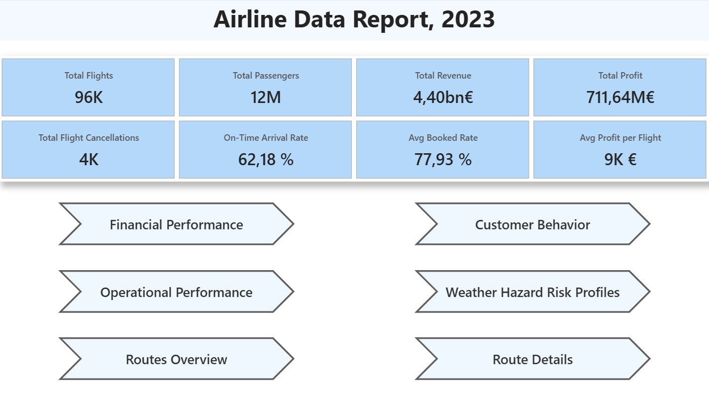
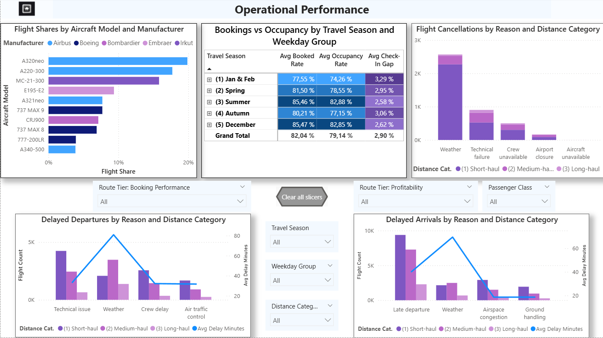
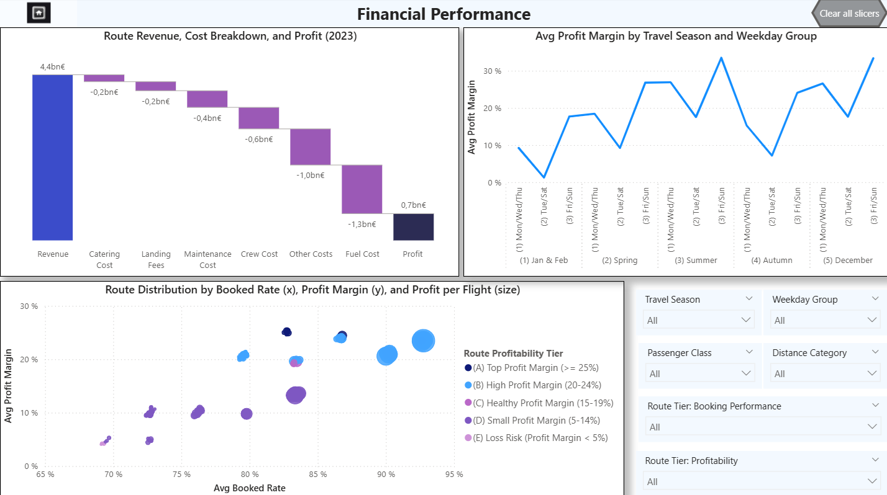
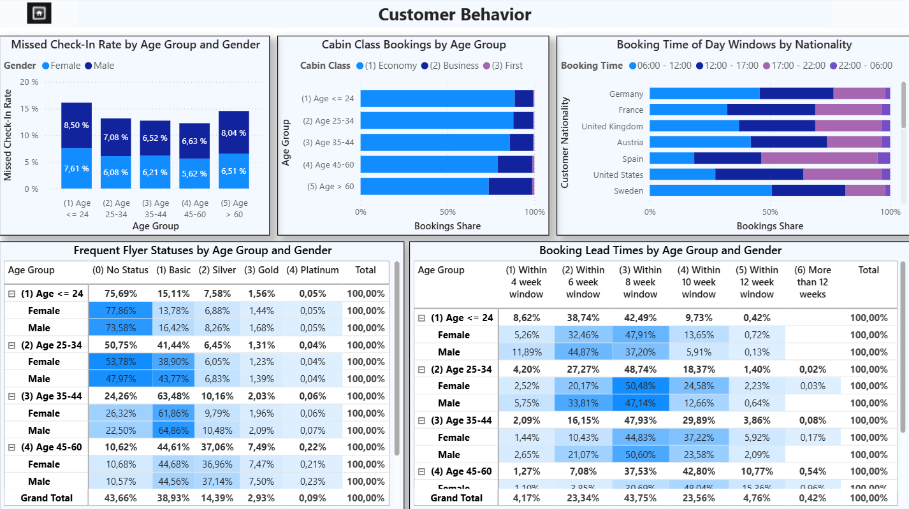
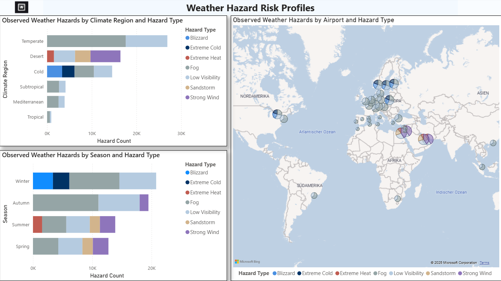
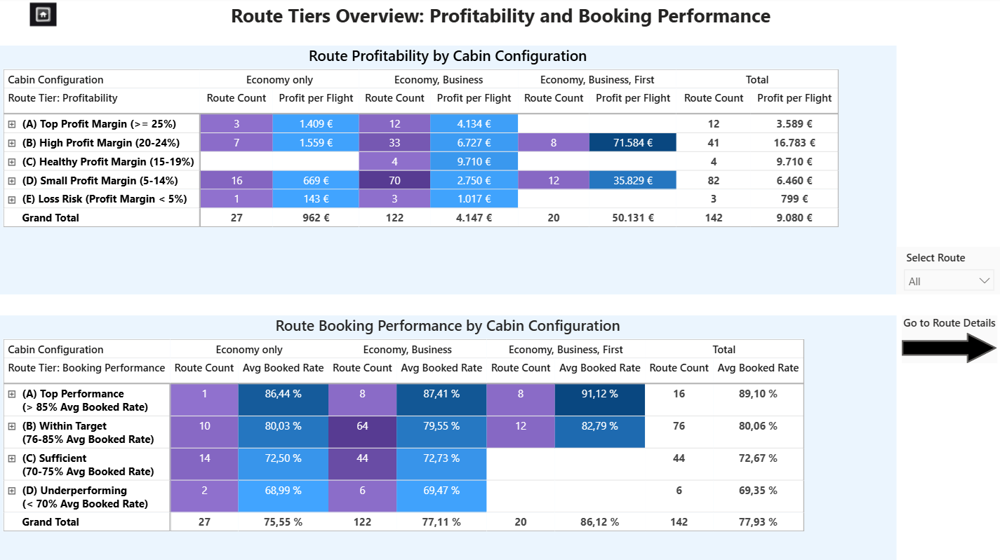

# Synthetical-Airline Data Report 2023 (Power BI Dashboard)

## Introduction

This Power BI dashboard showcases analytical and visualization capabilities using a synthetically generated airline 
dataset created for demonstration and skill-development purposes.
It provides an integrated view of simulated operations, financial performance, customer behavior, and environmental 
context – illustrating how multiple data domains can be combined into a unified analytical framework.

**Goal**: Offer a realistic example of how airline-style data can be modeled and analyzed to support decisions around 
route planning, pricing, reliability, and customer segmentation.

## Problem Statement

Airline-style datasets involve many interconnected components – flight operations, customers, costs, and environmental 
factors. When kept in separate tables, these areas can be difficult to analyze holistically.

This project demonstrates how a dashboard can unify such data to explore questions such as:

- Where do inefficiencies arise in aircraft utilization or route performance?
- How do operational disruptions affect financial outcomes?
- How do customer patterns relate to profitability and loyalty?
- How do geographical and environmental conditions influence reliability?

The dashboard is structured around five themes:  
**Operational Performance**, **Financial Performance**, **Customer Behavior**, **Geographic & Environmental Insights**, 
and **Route Tier Overview**.

## Skills Demonstrated

- **Data Modeling & Integration**  
Building a relational model connecting tables such as `routes_named`, `route_facts`, `route_class_facts`,
`aircraft_usage`, and `customer_groups`.
Relationships and hierarchies were designed to ensure consistent aggregation and drill-through behavior.
- **Data Transformation (Power Query)**  
Cleaning, reshaping, merging, and structuring simulated data into analysis-ready tables.
([Transformation Details](PBI_DATA_TRANS_DETAILS.md)) 
- **Analytical Modeling (DAX)**  
Creating measures and calculated columns for KPIs such as load factor, profit margin, cancellation rate, and 
revenue per flight.
- **Visualization & Storytelling**  
Designing dashboards featuring maps, matrices, heatmaps, and waterfalls with clear labeling and consistent formatting.
- **Collaborative Dashboard Engineering**  
Aligning data modeling decisions, jointly refining DAX measures and visuals, and coordinating iterative 
improvements to ensure a coherent, high-quality dashboard experience.
- **Performance Optimization**  
Applying model-size reduction, simplifying relationships, and using summary tables to improve responsiveness.
- **Business Insight & Interpretation**  
Turning simulated performance indicators into actionable insights for route planning, customer segmentation, and 
operational evaluation.

## Data Sourcing

All data in this dashboard is entirely synthetic.
It was generated using custom Python scripts and Power BI modeling techniques to resemble plausible airline-like 
behavior without representing any real airline.

The simulation includes:

- **Route and Aircraft Modelling**  
Synthetic networks of airports, distances, frequencies, and aircraft assignments.

- **Operational Patterns**  
Simulated cancellations, delays, and flight frequencies by weekday and season.

- **Financial Structures**  
Approximate revenue and cost distributions by route and cabin class.

- **Customer Behavior**  
Generated booking and demographic patterns linked to class, loyalty status, and check-in behavior.

- **Environmental Context**  
Weather hazard levels by climate region to enrich operational analysis.

## Modelling

The data model integrates operational, customer, and environmental tables into a unified structure.
Fact tables include:

- `route_facts`
- `route_class_facts`
- `delays`
- `cancellations`
- `aircraft_usage`

Dimension tables such as `routes_named`, `aircraft`, and `airport_names_clean`  provide descriptive context.
Additional lookup tables (`travel_seasons`, and `weekday_groups`) simplify time-based grouping and help avoid 
unnecessary many-to-many relationships.   

([Modelling Screenshot](screenshots/modelling_pbi.png))  

## Analysis and Visualisation
The dashboard is organized into five key analytical themes:  

### 1. Operational Performance    
Shows simulated utilization, reliability, and disruption patterns across routes and seasons.  
(Click on screenshot to play animation showcasing interactive elements.)

  

### 2. Financial Performance  
Breaks down revenue, costs, and profit metrics with interactive visuals such as margin matrices and cost waterfalls.  

  

### 3. Customer Behavior  
Highlights booking habits, segmentation patterns, frequent flyer distribution, and class preferences within the 
synthetic dataset. 

### 4. Geographic & Environmental Insights  
Maps the simulated route network and links weather hazard exposure to operational reliability.  

### 5. Route Tier Overview with Drill-Through  
Provides tier-based profitability summaries with drill-through into specific routes, aircraft, or customer segments.  
(Click on screenshot to play animation showcasing drill-through interactions.)

## Conclusion
This project demonstrates how synthetically generated airline-style data can be transformed into a cohesive 
Power BI dashboard that integrates operational, financial, customer, and environmental perspectives.
While not based on real-world data, the design faithfully mirrors analytical workflows used in aviation and other 
complex industries – illustrating best practices in BI modeling, DAX, visualization, and insight generation.

## Authors
Jan H. Schüttler ([LinkedIn](https://www.linkedin.com/in/jan-heinrich-sch%C3%BCttler-64b872396/)), Behzad Nematipour ([LinkedIn](https://linkedin.com/in/behzad-nematipour-99b8b4399))